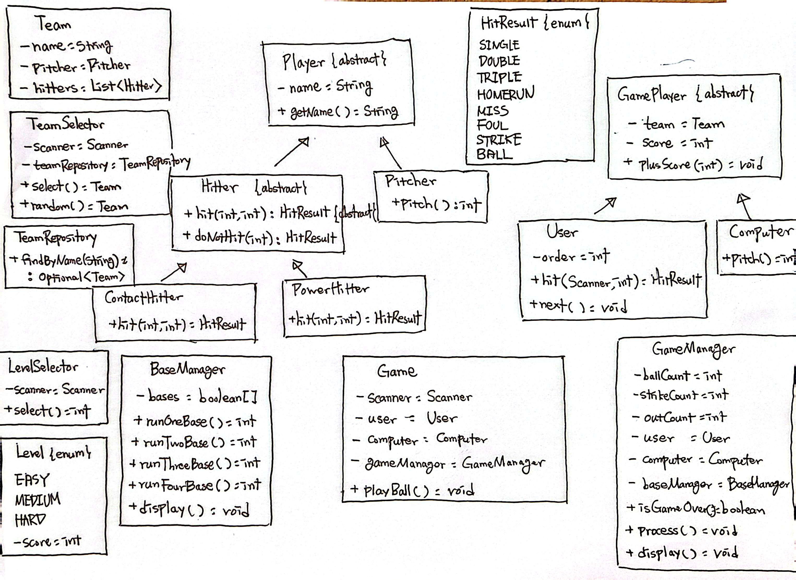

### 프로그램 소개
- 야구 게임을 진행할 수 있는 CLI 프로그램입니다.
- 팀과 난이도를 선택할 수 있고, 컴퓨터와 게임을 진행합니다.
- 9회 말 공격만 진행하고, 점수에 따라 승무패가 결정됩니다.

### 클래스 다이어그램
- Player, Hitter, Pitcher, ContactHitter, PowerHitter: 게임에 사용될 야구 선수 클래스
- GamePlayer, User, Computer: 게임에 참여할 플레이어 클래스
- Team: 게임 플레이어가 게임에서 선택할 야구 팀 클래스
- TeamSelector: 유저 또는 컴퓨터의 팀 선택 로직을 담당하는 클래스
- TeamRepository: 팀 데이터를 저장소에서 조회할 클래스
- Game: 게임 진행을 담당하는 클래스
- GameManager: 게임 내부에서 데이터 처리 및 관리를 담당하는 클래스
- BaseManager: 게임 내부 데이터 중 베이스 데이터 처리 및 관리를 담당하는 클래스
- LevelSelector: 컴퓨터의 난이도 선택 로직을 담당하는 클래스
- Level: 난이도 enum
- HitResult: 게임 내부 타자의 타격 결과 enum

### 프로그램 시연
https://github.com/user-attachments/assets/7791d73c-a53c-4358-9d79-33e7f7aa68cb